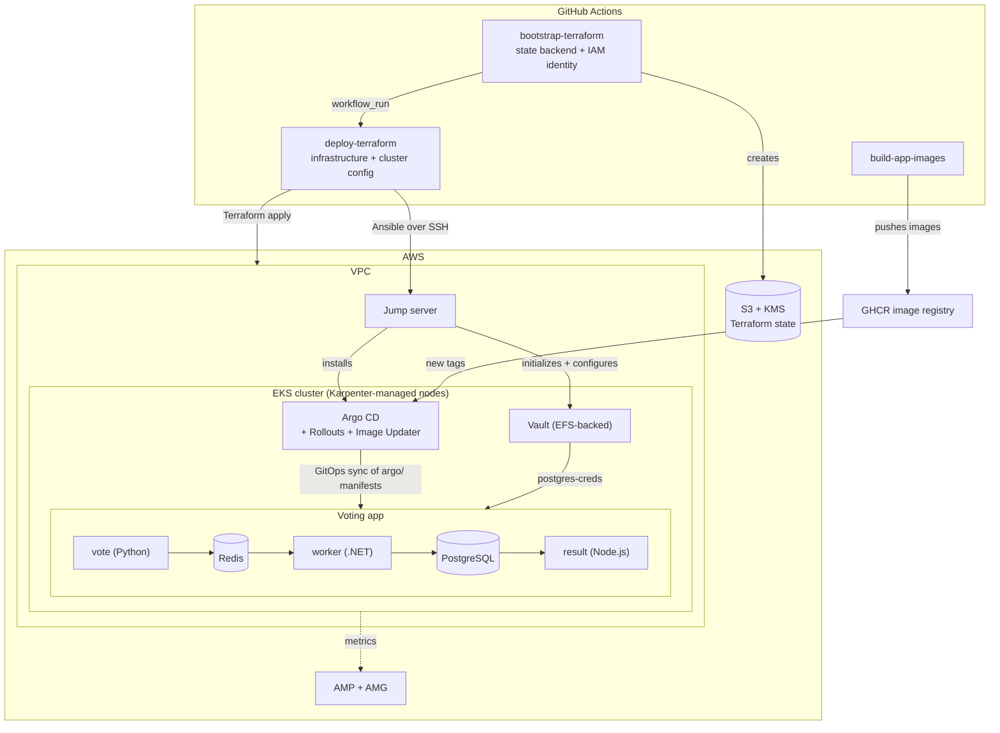

# Production-Ready Voting App

This project deploys Docker's official voting app sample to AWS with production-oriented infrastructure and operations.

It uses:
- EKS (AddOns, Pod identity)
- A jump server to manage EKS
- Karpenter + Node groups
- Argo CD, including Argo Rollouts and Image Updater
- Vault (data stored on Amazon EFS and unsealed with KMS)
- Amazon Managed Service for Prometheus (AMP) and Amazon Managed Grafana (AMG)

Terraform provisions the infrastructure, and Ansible configures the cluster. A `kube-prometheus-stack` agent (no in-cluster Grafana) scrapes cluster metrics and remote-writes them to AMP via EKS Pod Identity.

### Architecture overview

### Project layout

- **terraform/**: All infrastructure as code. `bootstrap/` provisions the Terraform state backend (S3 with native state locking) and the IAM identity the pipeline runs as; `deploy/` provisions the application infrastructure (VPC, EKS, node groups, EFS, controllers, IAM).
- **ansible/**: After infrastructure is up, playbooks configure the cluster through the jump server and provision Grafana locally — installing Argo CD and its applications, initializing/configuring Vault, and setting up the AMP data source and dashboards.
- **argo/**: Kubernetes manifests managed by Argo CD (GitOps) — the voting app, Vault, Karpenter, Rollouts, Image Updater, and shared Gateway API prerequisites.
- **app/**: The voting app source and Dockerfiles — `vote` (Python web UI), `worker` (.NET vote processor), `result` (Node.js results UI), and `seed-data`.

### Prerequisite
Enable an IAM Identity Center organization instance in the same region as the Grafana workspace (`us-east-1`). Terraform creates the `GrafanaAdmins` group, and the deploy workflow assigns it `ADMIN` on the Grafana workspace after each deploy (workspace permissions do not survive reprovisioning; see [terraform/README.md](terraform/README.md)). Group membership is managed manually in the AWS console.

Configure the following GitHub Actions secrets and variables:

**Secrets**:
- `JUMP_SERVER_PRIVATE_KEY`: OpenSSH private key used by the configure job to SSH into the jump server; must correspond to `JUMP_SERVER_PUBLIC_KEY`.
- `JUMP_SERVER_PUBLIC_KEY`: OpenSSH public key installed on the jump server; Terraform injects it into the EC2 key pair.
- `ARGOCD_REPO_TOKEN`: GitHub token used by Argo CD / Image Updater to read this repository and write back image tags.

Ansible generates the PostgreSQL password and writes it to Vault at `secret/postgres-creds`.

**Variables**:
- `AWS_REGION`: AWS region all infrastructure is deployed to (for example `us-east-1`).
- `STATE_BUCKET_NAME`: Name of the S3 bucket holding Terraform state; must match the bucket created by the bootstrap workflow.
- `JUMP_SERVER_SSH_CIDR`: IPv4 CIDR allowed to SSH to the jump server (restrict to your own IP, for example `203.0.113.10/32`; do not use `0.0.0.0/0`).

**Prerequisite**: The bootstrap identity needs permission to create IAM users, roles, and policies.

### Workflows

- **bootstrap-terraform** ([terraform-bootstrap-workflow.yaml](.github/workflows/terraform-bootstrap-workflow.yaml)): Runs on pushes/PRs to `main` that touch `terraform/bootstrap`, and provisions the foundational state backend (S3 bucket with native state locking) and IAM identity used by the deploy pipeline.
- **deploy-terraform** ([terraform-deploy-workflow.yaml](.github/workflows/terraform-deploy-workflow.yaml)): Triggered after a successful bootstrap run (or manually); validates, plans, applies the `terraform/deploy` infrastructure (VPC, EKS, node groups, EFS, controllers), then configures the cluster with Ansible (Argo CD, Vault, app bootstrap).
- **build-app-images** ([build-app-images.yaml](.github/workflows/build-app-images.yaml)): Runs when files under `app/` change; builds the changed component images (vote, result, worker, seed-data) and pushes them to GHCR with `main-latest` and commit-SHA tags for Argo Image Updater to roll out.

### EKS console access

Terraform creates an IAM role `${var.name}-eks-console-role` with read-only cluster access. To grant a user or role EKS console access, add its ARN to that role's trust policy (in the AWS IAM console or via `aws iam update-assume-role-policy`), then have the user assume the role with a console role-switch.